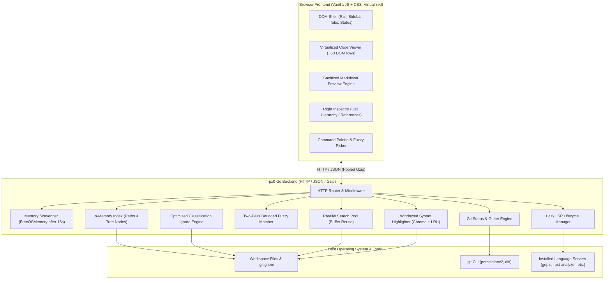

# px0 Internal Architecture & Design Documentation

Welcome to the internal engineering documentation for px0, an ultra-lightweight, zero-config code reader and navigator that delegates edits to the user's coding agent, packaged as a single statically-linked binary (~9.5 MB).

This directory contains in-depth technical write-ups explaining how px0 achieves sub-millisecond startup, instantaneous file navigation, deep code intelligence, and a minimal memory footprint (~20–30 MB RSS) across codebases containing tens of thousands of files.

## 1. Subsystem Architecture Map

## 2. Documentation Directory

The internal documentation is modularized into the following focused guides:

### Core Architecture & Server Runtime

- [System Architecture & Runtime Lifecycle](architecture.md): High-level architectural tenets, single-binary distribution, sub-millisecond startup sequence, HTTP router and endpoints, proactive memory scavenging (`debug.FreeOSMemory()`), and path sandboxing.
- [Filesystem Indexing & Ignore Engine](indexing-and-ignore.md): Bounded-concurrency directory traversal (`NumCPU * 4`), instant root availability, symlink cycle immunity, and the custom classification-based `.gitignore` engine.
- [Performance & Comparative Benchmarks](../../BENCHMARKS.md): Measurement methodology across the 7-repository test corpus (Flask to the Linux Kernel) and side-by-side memory/CPU comparison against the VS Code process tree.

### Search & Intelligence Engines

- [Fuzzy Path Matching](fuzzy-search.md): Two-pass bounded search algorithm ($O(N)$ scan time matching dynamic programming ranking accuracy), weighted scoring matrix, and parallel query slicing.
- [Workspace Search & Symbol Extraction](workspace-search.md): Multi-core parallel grep, buffer reuse (`workBuf`), whole-file rejection fast paths (`bytes.Contains`), smart snippet elision (`{Pre, Mid, Post}`), and regex outline extraction.
- [Windowed Syntax Highlighting](syntax-highlighting.md): Solving Chroma lexer bottlenecks with viewport-based windowing (`hlChunk = 1000`), byte-capping (`512 KB`), dual-tier tokenization (instant inexact window + background exact pass), and byte-budgeted LRU caching.
- [Language Server Protocol (LSP) Architecture](lsp-and-intelligence.md): Lazy on-demand server lifecycle, zero-cost background binary discovery, external path boundary control, stateless call hierarchy trails, in-app installer recipes, and regex fallback.
- [Git Awareness, Diffing & Stage/Commit/Push/Pull](git-integration.md): CLI shell-out architecture; status/diffing stay read-only, while the sidebar git panel's stage, commit, fast-forward-only pull, and push are explicit, click-triggered writes. Concurrent status generation with indexing, ancestor folder dirty propagation, gutter diff parsing, the client-side split/unified diff renderer, and AI-written commit messages via a file-free harness dispatch.
- [GitHub PR Review](github-pr-review.md): Extensible `GitProvider` interface and URL matching, zero-dependency REST client and multi-source auth resolution (`settings.json`, `GITHUB_TOKEN`, `GH_TOKEN`, `gh auth token`), animated CLI spinner, interactive merged-PR confirmation, temp-dir worktree checkout scoped to process lifetime, merge-base diffing instead of `HEAD`, fail-closed push-access gating, in-memory draft comment model, AI agent batch-apply integration, and pushing/fast-forward-pulling directly against the PR's own head branch.
- [Harness Editing & Agent Dispatch](agent-editing.md): The optional agent flow. Starting an edit from the selection bar, right-click menu or diff view, headless invocation contract for Claude Code / Gemini CLI / Cursor Agent, inline failure output, running several edits at once with an overlap guard and an uncommitted-work guard, change detection, the cache/language-server/tab reload path, and the file-free prompt dispatch (`StartPrompt`) behind the git panel's AI commit messages.
- [Threads](threads.md): Long-running multi-turn conversations with a harness. Native session resume for `claude` and `cursor-agent` with transcript replay for the rest, the stream-json event parser, the SSE feed and its drop-slow-subscriber rule, the on-disk store beside `settings.json`, and why there is no overlap guard.

### Frontend & UI Subsystems

- [Editor Virtualization & Caret Engine](editor-virtualization.md): Custom ~60-row DOM virtualization, offscreen sub-pixel font measurement, selection preservation across repaints, decoupled overlay caret, and non-destructive inline decorations.
- [Image Viewer & Asset Inspection](image-viewer.md): First-class image tabs, interactive viewport transforms (zoom, drag-to-pan, fit-to-window), background contrast cycling, adaptive smooth vs. pixelated rendering, and Markdown click-to-expand lightbox.
- [File Updates & In-Place Tab Reloading](file-reload-and-updates.md): End-to-end flow for workspace reindex and tab refreshing, in-place document reconciliation, concurrent chunk fetches, live viewport/markdown scroll snapshotting, and file shrinkage handling.
- [Markdown Preview Implementation](markdown.md): Goldmark pipeline, source line anchors (`data-line`), robust browser-side DOM allowlist sanitizer, and synchronized bi-directional scrolling between preview and source.
- [Theme Architecture & CSS Tokens](styling-and-themes.md): CSS custom property token architecture, zero literal colors in `style.css`, dynamic stylesheet discovery at `/static/themes.css`, and custom theme authoring.

### Operations & Maintenance

- [User Features Documentation](../features/README.md): High-level feature guides, practical workflows, and keyboard shortcuts for all px0 capabilities.
- [AI Agent Operational Guidelines](../agents/README.md): Engineering principles for AI coding agents, mandatory documentation maintenance protocol, and frontend codebase index.
- [Publishing & Release Guide](../../PUBLISHING.md): Step-by-step instructions for preparing, testing, and publishing new px0 releases.
