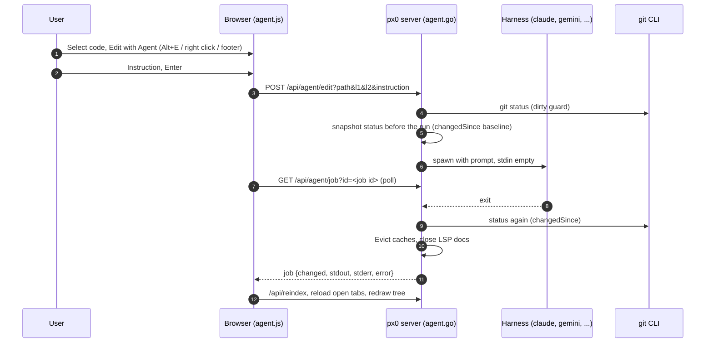

# Harness Editing & Agent Dispatch

This document describes the design and implementation of px0's editing flow:

- dispatch and change detection: [`agent.go`](../../agent.go)
- the persisted harness choice: [`settings.go`](../../settings.go)
- the instruction composers and footer controls: [`web/src/agent.js`](../../web/src/agent.js)
- the selection bar and right-click menu that start an edit: [`web/src/selbar.js`](../../web/src/selbar.js)

Harnesses are discovered automatically, the same way language servers are. Editing becomes available as soon as px0 finds one installed, but nothing ever runs until the user picks one, and that choice is remembered between runs. `-no-agent` removes the feature entirely; `-agent` pins a harness for scripted use and takes the choice away from the UI.

> Inline and batch edits now run as [threads](threads.md). `/api/agent/edit` and `/api/agent/batch` call `threadManager.StartEdit`, which creates a thread (kind `edit` or `batch`), runs the first turn through the same harness argv, and returns an `agentJob`-shaped snapshot. `agentManager.Job` and `CancelJob` consult the thread manager through hooks, so `/api/agent/job` and `/api/agent/cancel` and the browser's polling are unchanged. The overlap guard in section 5 is enforced by `threadManager.overlappingEdit`, against running inline and batch edits only. `Start`, `StartBatch` and `run` remain for `StartPrompt` (commit messages).

## 1. The Dispatcher Model

px0 does not author changes. No endpoint accepts file content; it composes a prompt and reloads whatever the harness wrote.

Editing works by delegation:

1. The user selects a range, in the code view or the diff view, and writes an instruction anchored to it.
2. px0 composes a prompt from that instruction plus the referenced source.
3. px0 spawns a coding harness already installed on the machine, with the workspace as its working directory.
4. The harness makes the change.
5. px0 works out what moved and reloads it in place.

Several edits can be in flight at once, each dispatched from its own composer box, as long as their line ranges don't overlap (section 5).



The hot path (indexing, highlighting, navigation) is untouched. The whole feature is two Go files, one ES module plus hooks in the selection bar, and five endpoints.

## 2. Starting an Edit

An edit always starts from a selection. The same actions are offered in three places, all backed by `runSelectionAction()` in `selbar.js`:

| Surface | How |
| --- | --- |
| Footer selection bar | `#footer-sel` replaces the footer's left-hand buttons while code is selected. |
| Right-click menu | `#sel-menu`, opened at the pointer by a right click on a selection. |
| Keyboard | `Alt+E` (Edit), alongside `Alt+C`, `Alt+A`, `Alt+U`. |

### The Right-Click Menu

The menu is rebuilt from the footer's own `[data-sel]` buttons every time it opens, so the two can never disagree about which actions exist or whether Edit with Agent is on offer (it is hidden when no harness is available). It takes over the browser's context menu only when the right click lands in the code view or the diff view and there is a selection. A right click on plain code keeps the browser's menu.

Two details keep the selection alive through the right click:

- The viewport's `mousedown` handler in `cursor.js` ignores every button but the primary one, so the caret does not move.
- The capture-phase handler that ends a whole-file (`Ctrl+A`) selection ignores right clicks and clicks inside the menu.

The menu closes on Escape, a click elsewhere, scroll, resize, window blur, or when the selection goes away.

### Selecting in the Diff View

Diff rows carry where they point in the working tree:

- `data-l`: the working-tree line of a context or added row. In the split layout a context line carries it on both sides, so a selection in the left (HEAD) column anchors just as well as one in the right.
- `data-at`: for a deleted row, which has no line on disk, the working-tree line it sat before.

`diffSelection()` gathers the stamped rows the selection intersects. It anchors to the range of `data-l` values, and a context line shown on both sides of a split is counted once. A selection of deleted lines alone anchors to the lines either side of where they were, clamped to the file. The text comes from the `.diff-code` cells alone, so the line-number and `+`/`-` gutters never leak into a prompt. Only the anchor reaches the harness: the prompt carries the lines on disk, not the deleted text.

## 3. Discovery, Selection and the Settings File

`Detect` walks the preset list and resolves each harness with `lookPathIn(name, lspBinDirs())`, the same helper the language-server manager uses. That search covers PATH plus the directories these tools actually install into, such as `~/.local/bin` and npm's global prefix. It runs on every `/api/agent/harnesses` call, so a harness installed after startup appears without a restart.

Discovery alone never enables editing. Finding `claude` on PATH is not consent to let it rewrite a workspace, so the first edit opens a picker and the choice is explicit. Once made, it is remembered and the picker stays out of the way.

The chosen harness and its model are directly selectable in the compose box's metadata row (`.agent-meta`). Changing either dropdown updates the configuration via `/api/agent/select`. When `-agent` pinned the harness, the selector indicates that it is fixed for this run.

The choice is written to:

```
$XDG_CONFIG_HOME/px0/settings.json     # when XDG_CONFIG_HOME is set
~/.px0/settings.json                   # otherwise
```

```json
{
  "agent": "claude"
}
```

This follows `stateFilePath` in [`update.go`](../../update.go) and sits beside the anonymous ID written by [`telemetry.go`](../../telemetry.go). px0 never writes its own state into a working tree: there is no `.px0/` directory in the repository.

A corrupt or stale settings file is never an error. If the saved harness has since been uninstalled it simply resolves to nothing selected, and the picker appears again.

The spec is persisted exactly as the user gave it. A command template shortens to its binary name for display, so saving the display name would break the round trip.

## 4. The Invocation Contract

Every supported harness starts an interactive session by default and blocks on an approval prompt. A naive spawn therefore hangs forever, producing no output and no error. Each preset carries both the flag that makes the run headless and the flag that lets it apply edits unattended:

| Harness | Default Model | Argv |
| --- | --- | --- |
| `claude` | `haiku` | `claude --permission-mode acceptEdits --model haiku -p {prompt}` |
| `gemini` | `gemini-2.5-flash-lite` | `gemini --approval-mode auto_edit -m gemini-2.5-flash-lite -p {prompt}` |
| `cursor-agent` | `gemini-3.6-flash-minimal` | `cursor-agent --force --model gemini-3.6-flash-minimal -p {prompt}` |
| `agy` | `gemini-3.6-flash-low` | `agy --dangerously-skip-permissions --mode accept-edits --model gemini-3.6-flash-low -p {prompt}` |
| `opencode` | `opencode/big-pickle` | `opencode run -m opencode/big-pickle {prompt}` |
| `codex` | `gpt-5-codex` | `codex exec --ask-for-approval never -m gpt-5-codex {prompt}` |
| `aider` | `claude-3-7-sonnet` | `aider --yes-always --no-auto-commits --model claude-3-7-sonnet --message {prompt}` |
| `goose` | `gpt-4o` | `goose run --no-session --model gpt-4o -t {prompt}` |

By default, px0 uses the least capable (fastest and cheapest) model from each harness's available model list, while letting users choose any available model from the harness menu or picker.

A full command template is accepted anywhere a harness name is, and must contain `{prompt}`:

```bash
px0 -agent "claude -p --permission-mode acceptEdits {prompt}"
```

The template is split on whitespace, and `{prompt}` is substituted inside each token, so both `{prompt}` and `--prompt={prompt}` work. Presets are a convenience, not a coupling: because a template is always available, a harness that changes its flags is a one-line fix by the user rather than a px0 release.

The binary is resolved before a harness can be selected, so a typo or an uninstalled tool fails at the point of choosing rather than on first use.

### Stdin Stays Empty

`cmd.Stdin` is never set. A harness that still decides to ask something reads EOF and exits, which surfaces as an error in the job. This mirrors the same decision in the language-server installer ([`lspsetup.go`](../../lspsetup.go)) and is the difference between a failed run and a hung one.

### Real-Time Streaming and Output

As the harness runs, lines from stdout and stderr are streamed in real time to the terminal stdout where px0 is running (`lineStreamer`), prefixed with `[<harness>]` so the developer can see exactly what the model is thinking, doing, and editing as it happens.

Stdout and stderr are simultaneously buffered into `tailBuffer`s for the `/api/agent/job` polling API.

A failed job comes back from `/api/agent/job` with an `error` field. The shared `request()` helper in `state.js` turns any `error` into a thrown `Error`, and attaches the parsed body as `e.body`. The poller recognises a job body there and hands it to `finish()` like any other result. The composer then shows the failure inline, under the instruction: the error line, then stderr and stdout in their own labelled blocks. A failure is never only a toast, because the harness's own output is usually the only explanation (an invalid API key, a missing login).

## 5. Overlap Guard and Uncommitted Work

Several harnesses can run at once, but never on the same lines: two rewriting the same range would produce a state nobody could review afterwards. `agentManager` keeps every in-flight job in `jobs map[int64]*agentJob` rather than a single slot, and `Start` refuses a dispatch with `409` when its `path:l1-l2` intersects a job that is still `Running` on the same path (`overlapLocked`). Disjoint ranges on the same file, or edits on different files entirely, run concurrently. The client mirrors the same check before it ever calls the server, so a doomed dispatch never leaves the browser (`rangesOverlap` in `agent.js`, against every open composer box).

Changing the harness mid-run is refused for as long as *any* job is in flight (`anyRunningLocked`), even if it wouldn't overlap: the harness choice is a single workspace-wide setting, and switching it out from under a running job would be surprising.

Edits on files with uncommitted changes always proceed directly without blocking or prompting for confirmation, enabling fluid iterative edits across files.

## 6. Determining What Changed

A harness routinely edits files nobody pointed it at, so the set of touched files is never inferred from the prompt. `changedSince` compares a `worktreeSnapshot` taken before the run with one taken after, in both directions:

- A path whose entry is new or different was touched.
- A path that has left the list entirely was restored to its committed state, which is also a change.

`worktreeSnapshot` is `gitStatus` with each listed file's size and modification time folded into its entry. Status alone misses the most common case in review: editing a file that is already modified reads `M` before and after, so the edit would go unseen and nothing would reload. Clean files are not stamped; a change to one surfaces through status on its own.

That set drives the reload and the summary shown to the user.

Outside a git repository there is no status to compare, so the job reports `tracked: false` and an empty change list. The client treats that as "unknown" rather than "nothing" and reloads the workspace regardless.

## 7. The Reload Path

The syntax highlighting cache memoises on `path + mtime + size` ([`highlight.go`](../../highlight.go)), so a rewritten file misses the cache on its own and no invalidation is needed for the common case. Two things still need explicit handling:

- Torn reads. `Open` stats and then reads, non-atomically. A harness that truncates and writes in place can be caught mid-write, and that partial copy would then sit under a cache key nothing invalidates. Every changed file is therefore passed to `Evict` before the reload.
- Stale language servers. `gopls` and friends hold their own copy of a file and never saw the write, so go-to-definition and hover would drift. Each changed file is passed to `lsp.CloseDoc`, and the server reopens it on the next request.

The frontend's `reloadWorkspace()` then reloads in dependency order: `/api/reindex` first so the tree and git badges agree with disk, then `reloadOpenTabs()`, then a tree redraw. Every finished edit shares it, queued (`reloadChain` in `agent.js`) so two finishing close together don't interleave their requests.

### Each Tab Keeps Its View

`reloadOpenTabs()` keeps each tab in the view it was in. A tab in source view stays in source even though the file now has a diff; the tab is marked `diffDismissed` so the gutter load does not flip it either. A tab in the diff view stays there, refetches `/api/diff` for the new document, and restores the diff view's scroll position (`diffScroll`). Scroll position, cursor line and Markdown preview scroll are preserved as before.

### No File Watcher

px0 dispatched the harness, so it knows when the work ended. Completion is detected by the process exiting, not by watching the filesystem. There is no `fsnotify` dependency, no polling of the tree, and the single-binary, zero-dependency footprint is unchanged.

## 8. HTTP Surface

| Endpoint | Method | Purpose |
| --- | --- | --- |
| `/api/agent/harnesses` | GET | Re-scan and list every known harness with its installed state. |
| `/api/agent/select` | POST | Choose a harness and remember it. An empty name turns editing off. |
| `/api/agent/edit` | POST | Dispatch an instruction for `path:l1-l2`. `409` when the range overlaps a job already running, or onto uncommitted work without `force=1`. |
| `/api/agent/job` | GET | Snapshot of job `?id=`, or the most recently started job when `id` is omitted, polled while running. |
| `/api/agent/cancel` | POST | Stop every harness currently running. Whatever each already wrote stays. |
| `/api/git/commit-message` | POST | Dispatch the selected harness to write a commit message for the staged diff (git panel's **Commit with AI**). Not part of this file — see below. |

### A Second Dispatch Shape: Prompts With No File

Every dispatch above is anchored to a file range. `agentManager.StartPrompt(label, prompt)` is a narrower sibling of `StartBatch` used by exactly one caller today — the sidebar git panel's **Commit with AI** (`handleGitCommitMessage` in `server.go`, [Git Awareness §9](git-integration.md)) — to have a harness write a commit message rather than edit code. It skips everything file-range-specific (no snippet read, no overlap check against `jobs`, no target path) and reuses `run()` unchanged: same spawn, same `tailBuffer` stdout/stderr capture, same `changedSince` diff (which comes back empty, since a well-behaved prompt like this never touches disk). The `agentJob` it returns is polled through the very same `/api/agent/job`, so the frontend's polling logic doesn't need to know which kind of job it's watching.

A job snapshot:

```json
{
  "id": 3,
  "harness": "claude",
  "path": "server.go",
  "lines": "40-52",
  "running": false,
  "error": "exit status 1",
  "stdout": "…",
  "stderr": "…",
  "log": "…",
  "changed": ["server.go"],
  "tracked": true,
  "ms": 4425
}
```

`/api/meta` carries `agent` (the selected name, or empty), `agentPinned`, and `agents` (the detected list), so the UI can decide at boot whether to offer editing without a second request.

Every mutating endpoint is guarded by `localPost` ([`lspsetup.go`](../../lspsetup.go)): POST only, `Origin` must match `Host`, and `Host` must be an IP address or `localhost`, which shuts out DNS rebinding.

### Security Posture

The edit endpoint runs a general-purpose coding agent with shell access as the user who started px0. `localPost` restricts it to px0's own page reached by IP address or `localhost`. That shuts out other websites and DNS rebinding, and makes editing unavailable through the hostname-based tunnels and reverse proxies described in the README. It is not authentication: with `-host 0.0.0.0`, anyone who can reach px0 by IP, for example over Tailscale, can dispatch an edit. Exposing editing beyond a trusted network requires an authentication story px0 does not yet have.

The explicit first-run pick matters for the same reason. Auto-enabling on discovery would mean any px0 instance on a machine with a harness installed is a code execution endpoint that nobody opted into.

## 9. Limits

- The job keeps the last 32 KB of each of stdout and stderr (`tailBuffer`), enough to explain a failure without holding a full transcript.
- A run is abandoned after 10 minutes.
- Changes to gitignored files are invisible to `git status`, so they are never reloaded.
- Inline edit instructions live in memory for the life of the process. Only the harness choice is persisted, and never inside a workspace. Conversations that should persist are [threads](threads.md).
- Leaving the tab while an edit is in flight is guarded by a `beforeunload` prompt, but closing the browser process outright or losing power still abandons the harness mid-run with no undo to fall back on.
