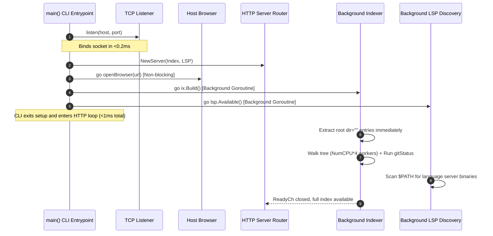

# System Architecture & Runtime Lifecycle

This document describes the high-level architecture, startup pipeline, HTTP server, memory scavenging, and security model of `px0`.

## 1. High-Level Design Principles

px0 is engineered as an ultra-fast, zero-overhead code exploration console. Its architecture is guided by five foundational tenets:

1. Edits Are Delegated: px0 navigates, searches, and inspects code, and does not author changes itself. There are no save buttons and no endpoint accepts file content. Changes are made by a coding harness px0 dispatches on request, one per non-overlapping line range so several can run at once (see [Harness Editing & Agent Dispatch](agent-editing.md)).
1. Single Static Binary Footprint: All frontend assets (HTML, CSS, JavaScript, icons, themes) are embedded directly into the Go binary at compile time via `go:embed`. px0 requires no Node.js, Python, or Ruby runtime, no external database, and no CGO dependencies.
1. Sub-Millisecond Responsiveness: The HTTP listener binds, serves the web UI, and opens the default browser in under 1 millisecond. Heavy operations (full directory indexing, git status checks, language server binary discovery) run asynchronously off the critical path.
1. Stateless in the Workspace: px0 never writes configuration directories, temporary caches, or metadata files (e.g., `.px0/` or `.cache/`) into a workspace. Indexes and caches live in volatile memory. Outside the workspace it keeps only the remembered harness choice and update/telemetry state under `~/.px0/` (or `$XDG_CONFIG_HOME/px0/`).
1. Strict Memory Reclamation: Long-lived background processes should not hold idle RAM. When the user finishes a burst of queries, unused pages are proactively returned to the operating system.

The browser's file tabs are managed in `web/src/tabs.js`. Tab context-menu actions and the tab close button share cache cleanup. A bulk close updates the browser view and session once after removing the selected tabs.

## 2. Startup Pipeline (<1 ms Critical Path)

When `px0` is executed in a terminal (e.g., `px0 .` or `px0 main.go:42`), the initialization flow executes as follows. A file target detects its enclosing project repository (or working directory) as the workspace and is passed to the browser with its relative path and optional line number.



### Key Stages in [`main.go`](../../main.go)

1. Target Resolution: Directories become workspace roots. For a file target, its repository or project root is detected as the workspace, and its relative path (with optional line number) is retained for the initial browser tab.
1. Socket Binding: `listen(*host, *port)` binds an ephemeral or user-specified TCP socket immediately.
1. Instant Root Tree Extraction: Before descending into subdirectories, `ix.Build()` extracts and populates the root directory entries (`dir=""`), publishing them directly to `ix.children[""]`. When the browser makes its initial request to `/api/tree`, it immediately renders the root tree nodes without waiting for the deep repository scan to finish.

1. Non-Blocking Browser Launch: `go openBrowser(url)` spawns the platform-specific browser opener (`xdg-open` on Linux, `open` on macOS, `rundll32` on Windows) in a separate goroutine.
1. Concurrent Tree Walk & Git Status: Indexing runs inside a background goroutine. A dedicated goroutine runs `gitStatus(ix.root)` in parallel with the file walk so that subprocess overhead overlaps the walk rather than adding to it.
1. Background Language Server Discovery: `lsp.Available()` checks `$PATH` using `exec.LookPath` across standard binary locations asynchronously.

The explorer expands folders through `/api/tree` on demand. Expand All skips ignored subtrees, keeps at most four directory requests in flight, and marks the header control busy while it runs. Tree refreshes and user navigation invalidate older requests before they can redraw stale folders; Collapse All clears open state immediately.

## 3. HTTP Server & API Catalog

The server is implemented in [`server.go`](../../server.go) using Go's standard `http.ServeMux`. Every request passes through a centralized `ServeHTTP` wrapper that records activity timestamps, tracks status codes and durations, applies pooled Gzip compression when accepted by the client (excluding SSE streams), and logs every HTTP request to the terminal when the `-verbose` flag is active.

### Base Path & Subpath Prefixing
When hosted behind reverse proxies or multi-tenant review platforms, px0 supports custom URL prefixes via the `-base-path` CLI flag or `server.basePath` in settings (e.g. `/rev-123/`):
- All routes below are prefixed with the base path (`/<base-path>/api/...`, `/<base-path>/static/...`).
- `handleIndex` dynamically injects `<base href="/<base-path>/">` into `web/index.html`, allowing the frontend to resolve relative assets and API endpoints without domain-level assumptions.
- Requests to `/<base-path>` without a trailing slash redirect to `/<base-path>/`, and root `/` redirects to the configured base path.

### Endpoints Reference

| Endpoint              | Method | Purpose                                                                 | Response Format                            |
| --------------------- | ------ | ----------------------------------------------------------------------- | ------------------------------------------ |
| `/`                   | `GET`  | Serves `web/index.html` (embedded or `-dev` disk copy)                  | `text/html; charset=utf-8`                 |
| `/static/*`           | `GET`  | Serves bundled JavaScript, CSS, and static assets                       | Asset MIME type                            |
| `/static/themes.css`  | `GET`  | Concatenates all `web/themes/*.css` files in alphanumeric order         | `text/css; charset=utf-8`                  |
| `/api/meta`           | `GET`  | Workspace metadata (root path, file count, index duration, git status)  | JSON (`{root, name, files, build_ms, git}`)|
| `/api/metrics`        | `GET`  | Point-in-time process memory, CPU, and goroutine stats (polled via `/api/stream` SSE) | JSON (`{rssBytes, cpuUsage, goroutines}`)|
| `/api/tree`           | `GET`  | Directory contents for the sidebar file explorer (`?dir=path`)          | JSON array of `Node` objects               |
| `/api/file`           | `GET`  | Windowed, highlighted source file lines (`?path=...&start=0&count=500`) | JSON (`{lines, total, refine, markdown}`)  |
| `/api/raw`            | `GET`  | Raw, unhighlighted file content for whole-file copies and preview assets| `text/plain` or binary                     |
| `/api/markdown`       | `GET`  | Converted HTML preview of `.md` / `.markdown` files via goldmark        | JSON (`{path, html}`)                      |
| `/api/find`           | `GET`  | Fast fuzzy match against all indexed workspace paths (`?q=...`)         | JSON array of `FuzzyResult` objects        |
| `/api/search`         | `GET`  | Full-text project grep with snippet elision (`?q=...&case=...&regex=...`)| JSON array of file hits and matches        |
| `/api/outline`        | `GET`  | Regex-extracted symbol outline for a given file (`?path=...`)          | JSON array of symbol declarations          |
| `/api/def`            | `GET`  | Quick definition lookup fallback                                        | JSON array of matching definition locations|
| `/api/diff`           | `GET`  | Unified diff of working tree vs. `HEAD` (`?path=...`)                   | JSON (`{path, diff, available}`)           |
| `/api/gutter`         | `GET`  | Per-line change markers for code view gutter                            | JSON (`{added, modified, deleted}`)        |
| `/api/stream`         | `GET`  | Unified SSE stream for real-time `git-status` and `metrics` events (aliased by `/api/git/stream`) | `text/event-stream`   |
| `/api/git/refresh`    | `POST` | Triggers immediate git status check and returns status payload          | JSON (`{git, gitChanges, gitFiles, ...}`)  |
| `/api/reindex`        | `POST` | Re-runs index walk and git status on demand (triggers frontend tab reload; see [`file-reload-and-updates.md`](file-reload-and-updates.md)) | JSON (`{files, indexMs}`)                  |
| `/api/lsp/def`        | `GET`  | Go-to-Definition via LSP (`?path=...&line=...&col=...`)                 | JSON array of target locations             |
| `/api/lsp/refs`       | `GET`  | Find References via LSP                                                 | JSON array of reference locations          |
| `/api/lsp/calls`      | `POST` | Incoming/outgoing call hierarchy tree expansion                         | JSON array of `CallNode` objects           |
| `/api/lsp/symbols`    | `GET`  | Document symbols extracted via LSP                                      | JSON array of LSP symbols                  |
| `/api/lsp/hover`      | `GET`  | Type signature and markdown doc hovercard info                          | JSON (`{contents: ...}`)                   |
| `/api/lsp/warm`       | `POST` | Pre-warms or spawns language server for given file extension            | JSON (`{ok: true}`)                        |
| `/api/lsp/setup`      | `GET`  | Reports install status and commands for current file language           | JSON (`{installed, recipes, ...}`)         |
| `/api/lsp/install`    | `POST` | Executes user-level installer in background                             | JSON (`{ok: true}`)                        |
| `/api/lsp/start`      | `POST` | Rescans and starts language server after installation                   | JSON (`{ok: true}`)                        |
| `/api/agent/harnesses`| `GET`  | Detected coding harnesses and the current choice                        | JSON (`{harnesses, selected, pinned, settings}`) |
| `/api/agent/select`   | `POST` | Choose and remember a harness (`?name=...`)                             | JSON (`{harnesses, selected, pinned, settings}`) |
| `/api/agent/edit`     | `POST` | Dispatch an instruction to the harness (`?path=...&l1=...&l2=...&instruction=...`) | JSON job snapshot               |
| `/api/agent/job`      | `GET`  | Snapshot of job `?id=...`, or the most recently started when omitted: output, changed files | JSON job snapshot          |
| `/api/agent/cancel`   | `POST` | Stop every running harness                                              | JSON (`{cancelled}`)                       |

## 4. Memory Management & Proactive Scavenging

Even though Go's garbage collector frees unreferenced heap objects rapidly, the Go runtime does not immediately release physical memory pages back to the host operating system. In high-churn CLI sessions (such as searching a 50,000-file repository), the process resident set size (RSS) could appear inflated long after the search completes.

To maintain a lean footprint (~20–30 MB RSS), `server.go` implements an automatic scavenger:

```go
func (s *Server) scavenge() {
    const idleFor = 15 * time.Second
    tick := time.NewTicker(10 * time.Second)
    defer tick.Stop()
    done := true
    for range tick.C {
        idle := time.Since(time.Unix(0, s.lastReq.Load()))
        if idle < idleFor {
            done = false
            continue
        }
        if done {
            continue
        }
        debug.FreeOSMemory()
        done = true
    }
}
```

### Scavenging Mechanism

- `s.lastReq`: An atomic 64-bit integer tracks the Unix timestamp (in nanoseconds) of the most recent incoming HTTP request.
- When no HTTP traffic has arrived for 15 seconds after an active period, `debug.FreeOSMemory()` is invoked.
- Physical memory pages freed by the GC are surrendered back to the operating system kernel immediately, preventing background memory bloat.

### Client-Server Memory Split & Total Footprint

Because px0 uses a client-server architecture rather than embedding Electron:
- **Host Server**: The Go backend daemon occupies ~20–30 MB RSS, handling indexing, symbol discovery, regex search, and git operations.
- **Client Browser Tab**: The frontend web client runs in the user's existing browser, allocating ~80–150 MB for the DOM, V8 runtime, and GPU compositing. Memory is kept strictly bounded because px0's bespoke virtualized scroller mounts only ~60 active rows regardless of file size.
- **Combined Impact**: Total system footprint is ~100–180 MB (~85–90% lower than the ~1,400 MB footprint of desktop Electron IDEs). On remote devboxes and containers, the host pays strictly the ~20–30 MB server cost.

### Gzip Buffer Pooling

To avoid heap allocations on every JSON endpoint response, `gzip.Writer` instances are pooled via `sync.Pool` using `gzip.BestSpeed`:

```go
var gzipPool = sync.Pool{New: func() any {
    w, _ := gzip.NewWriterLevel(io.Discard, gzip.BestSpeed)
    return w
}}
```

## 5. Security Model & Path Sandboxing

Because px0 exposes a local HTTP server that can display source files and interact with local tools, strict boundary constraints are enforced.

### Path Resolution (`safePath` & `resolvePath`)

Paths supplied by client queries are rigorously sanitized:

1. Leading slashes and spaces are trimmed.
1. The path is cleaned via `filepath.Clean()`.
1. Paths attempting directory traversal (`..`, `../`, or containing `..` path segments) are rejected with HTTP 400.
1. Any path that resolves outside the indexed workspace root is rejected, unless it has been explicitly admitted into the external path allowlist (`extAllowed`).

### External Path Allowlist (`extAllowed`)

When navigating code via LSP Go-to-Definition, targets often reside outside the workspace directory (e.g., standard library packages in `/usr/local/go/src` or cached crates in `~/.cargo/registry`).

- Rather than opening up arbitrary filesystem reads, targets returned by the trusted LSP server are admitted into an in-memory allowlist: `extAllowed[canonicalPath] = true`.
- `/api/file` and `/api/raw` permit reading external files only if the exact path exists in `extAllowed`.
- External paths can never be enumerated via `/api/tree` or searched via `/api/search`.

### Origin Verification for Installers

The `/api/lsp/install` and `/api/lsp/start` endpoints execute shell commands (e.g., `go install ...` or `npm install -g ...`), and the `/api/agent/*` mutations run a coding harness. To guard against cross-origin attacks (such as a malicious website triggering command execution via JavaScript fetch while px0 is running in the background):

1. The request method must be `POST`.
1. The request `Origin` header must match the request `Host` header.
1. The `Host` header is validated to ensure it is strictly an IP address (`127.0.0.1`, `[::1]`) or `localhost`. This prevents DNS-rebinding attacks.
1. The executed command is never supplied by the client; it is looked up exclusively from the hard-coded internal `lspRegistry`, or, for agent edits, from the harness the user picked (only the instruction text comes from the client).

### Self-Update Integrity

Before `px0 --update` executes or installs a release binary, it verifies the download against the SHA-256 digest in that release's `checksums.txt` asset. Missing, malformed, or mismatched checksum data aborts the update without replacing the current executable.
