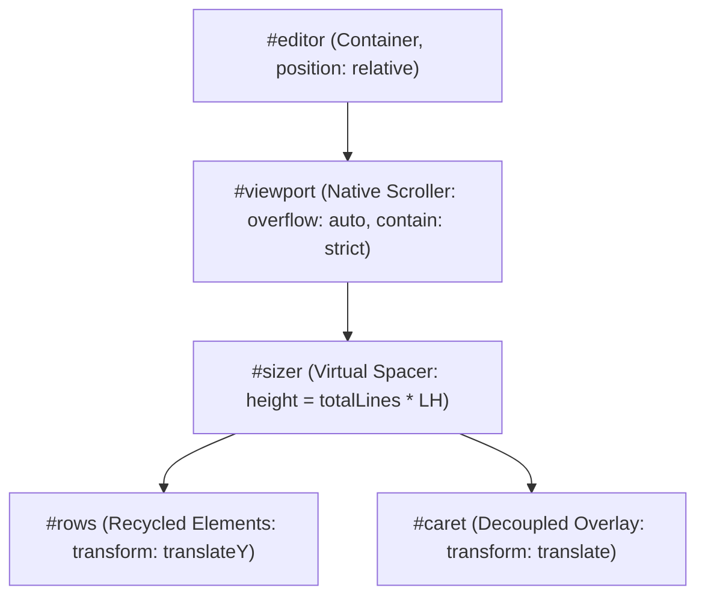
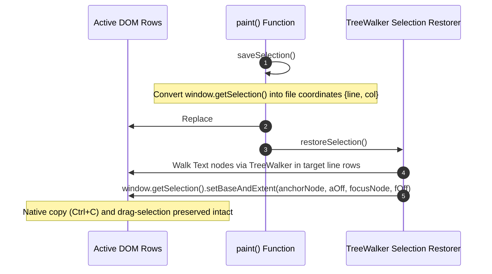

# Editor Virtualization & Caret Engine

This document provides a comprehensive technical breakdown of px0's bespoke virtualized code viewer, caret engine, and selection preservation system ([`web/src/renderer.js`](../../web/src/renderer.js), [`web/src/cursor.js`](../../web/src/cursor.js), and [`web/style.css`](../../web/style.css)).

The sidebar file tree uses a separate on-demand rendering path in [`web/src/tree.js`](../../web/src/tree.js). Its Expand All control loads indexed directory children in batches of four requests, skips ignored subtrees, and can be cancelled without allowing late responses to reopen collapsed folders. The editor viewport virtualization described below runs independently of the sidebar tree state.

The tab bar is managed by [`web/src/tabs.js`](../../web/src/tabs.js). Its right-click menu closes selected groups in descending index order. Single and bulk actions share cache cleanup and active-tab selection, then redraw the tab bar and editor and persist the session once per action.

## 1. Why a Bespoke Virtualized Viewer?

General-purpose browser code editors (such as Monaco, CodeMirror 6, or Ace) are engineered for bidirectional text editing, undo/redo trees, multi-cursor keystrokes, and complex grammar parsing inside the browser. Consequently:

- They bundle massive JavaScript runtimes (several megabytes).
- Their initialization latency takes hundreds of milliseconds.
- Complex DOM representations degrade frame rates when scrolling large files.

Because px0 is a code inspection and navigation tool that never edits text in place (changes go through a coding harness), it bypasses heavy third-party editor runtimes entirely. Instead, it implements a custom, high-performance virtualized surface with a fixed DOM footprint (~60 active nodes) and sub-millisecond paint budgets. This architectural choice keeps the frontend browser tab's RAM strictly bounded (~80–150 MB), ensuring that the combined client-server footprint (~100–180 MB) remains an order of magnitude leaner than Electron IDEs without suffering memory creep on large files.

## 2. DOM Surface Hierarchy

The editor surface is defined in [`web/index.html`](../../web/index.html):

```html
<div id="editor">
  <div id="viewport">
    <div id="sizer">
      <div id="rows"></div>
      <div id="caret" hidden></div>
    </div>
  </div>
  <div id="findbar">...</div>
</div>
```



### Element Roles & Responsibilities

- `#viewport`:
  - CSS: `position: absolute; inset: 0; overflow: auto; contain: strict; cursor: text;`
  - Encapsulates native browser scrolling mechanics, trackpad physics, and wheel events.
- `#sizer`:
  - Functions as the scrollable canvas spacer.
  - Its vertical height is calculated during `layout()` as:
    $$\text{height} = \text{totalLines} \times \text{LH} + \text{verticalPadding}$$
  - Its width expands based on word-wrap settings or:
    $$\text{width} = (\text{maxCols} + 4) \times \text{chW} + \text{gutterWidth}$$
  - Configures the browser's native scrollbar geometry with mathematical precision without mounting offscreen rows.
- `#rows`:
  - CSS: `position: absolute; top: 0; left: 0; will-change: transform;`
  - Mounts only the visible lines.
  - Positioned vertically using CSS `transform: translateY(first * LH + "px")` to maintain exact alignment with `#viewport` without triggering layout reflows.
- `#caret`:
  - Independent overlay cursor element positioned directly under `#sizer`.

## 3. Virtualization & Recycling Pipeline (`paint()`)

The browser DOM never holds elements for lines outside the immediate view. Only the current viewport plus overscan buffers are instantiated:

### Virtual Window Mathematics

$$\text{first} = \max\left(0, \left\lfloor\frac{\text{scrollTop}}{\text{LH}}\right\rfloor - \text{OVERSCAN}\right)$$
$$\text{count} = \left\lceil\frac{\text{clientHeight}}{\text{LH}}\right\rceil + 2 \times \text{OVERSCAN} \quad (\text{OVERSCAN} = 24)$$
$$\text{last} = \min(\text{totalLines}, \text{first} + \text{count})$$

At standard desktop display resolutions, the total number of mounted `.row` elements is capped between 50 and 70 elements.

### HTML Row Structure

Each line inside `#rows` consists of:

```html
<div class="row" data-l="123">
  <div class="g">123</div>
  <div class="c">...syntax token markup...</div>
</div>
```

- `.g`: Line number gutter element (`position: sticky; left: 0; z-index: 2;`).
- `.c`: Code container (`white-space: pre; tab-size: 4; font-family: var(--font-mono);`).

### Frame Throttling via `requestAnimationFrame`

Scroll events are debounced to ensure painting runs in lockstep with the browser's display refresh rate:

```javascript
let raf = 0;
export function render() {
  if (raf) return;
  raf = requestAnimationFrame(() => {
    raf = 0;
    paint();
  });
}
```

## 4. Offscreen Sub-Pixel Font Measurement

Proportional gutter widths and accurate scroll geometry require exact character dimensions. However, querying DOM layout properties (`offsetWidth`, `getBoundingClientRect`) during rendering triggers costly browser layout thrashing.

Instead, px0 measures typography once via an offscreen DOM element (`#measure`):

- `LH` (Line Height) and `chW` (Character Width) are measured with sub-pixel fractional precision.
- Values are cached in state `S.chW` and `S.LH`.
- Scrollbar dimensions and virtual positions are computed algebraically without reading DOM layout metrics.

## 5. Selection Preservation Across Repaints

A major pitfall of virtualized DOMs is that rebuilding or recycling `.row` elements drops the browser's active native text selection (e.g., when scrolling or refreshing background syntax highlighting).

px0 solves this with Coordinate-Based Selection Persistence:



1. `saveSelection()`: Inspects `window.getSelection()`, determines the anchor and focus nodes, and maps them to file-level `{ line, col }` coordinates.
1. DOM Update: `#rows.innerHTML` is updated with the visible window.
1. `restoreSelection()`: Uses a `TreeWalker` over the newly mounted rows to find the exact matching text offsets and calls `window.getSelection().setBaseAndExtent()`.

## 6. Decoupled Overlay Caret (`placeCaret()`)

Unlike traditional editors that insert a cursor DOM element inside code lines, px0's caret is decoupled:

- The `#caret` element lives as a direct child of `#sizer`.
- `placeCaret(line, col)` computes the collapsed range geometry using `toPoint(line, col)`.
- The caret is positioned using hardware-accelerated CSS `transform: translate(x, y)`.

### Architectural Benefits

1. Clean Row Markup: Text nodes inside `.c` containers remain pure code without intrusive caret tags.
1. Native Copy Integrity: Selecting text never accidentally copies caret artifacts.
1. Zero Interaction Conflicts: Mouse drag selections never fight with caret repaints.

## 7. Non-Destructive Inline DOM Decorations

Search match markers (`<mark>`), symbol occurrence markers (`.occ`), and definition jump links (`.link`) are added dynamically via `decorate()`:

- Applied exclusively to the ~60 active rows.
- Uses `document.createTreeWalker(row, NodeFilter.SHOW_TEXT)` to inspect only text nodes within `.c`.
- Matches are split and wrapped without destroying or invalidating surrounding syntax highlighting tags (`.k`, `.s`, etc.).

## 8. Dynamic Chunk Streaming & Whole-File Selection
### On-Demand Chunk Fetching (`ensureChunks`)

Source lines are loaded from `/api/file` in chunks of `CHUNK = 500` lines:

- As the user scrolls, `ensureChunks(d, first, last)` identifies missing 500-line blocks.
- Asynchronous API fetches retrieve missing chunks.
- When an inexact windowed chunk arrives (`refine: true`), `refineChunk()` automatically swaps in corrected lines once the server's background pass finishes.

### Whole-File Selection (`selectAll()`)

Pressing `Ctrl+A` / `Cmd+A` outside a text input does not use the browser's native select-all (which would select sidebar text and fail on virtualized offscreen code).

- `selectAll()` activates `S.selAll` mode for the active document.
- `paint()` visually shades all currently rendered rows.
- File contents are retrieved once from `/api/raw` so that `Ctrl+C` copies the entire file to the clipboard cleanly.
- Esc, a left click, or tab switching clears whole-file selection mode. A right click keeps it, so the selection menu can act on it.

### Selection Actions

Any selection, native or whole-file, drives the footer selection bar (`#footer-sel`) and the right-click menu (`#sel-menu`) in [`web/src/selbar.js`](../../web/src/selbar.js): Copy Ref, Copy with Context, Edit Inline, Find Usages, and reference copying via `Alt+C`. The viewport's `mousedown` handler only moves the caret for the primary button, so a right click on a selection neither moves the caret nor collapses the selection. See [Harness Editing & Agent Dispatch](agent-editing.md).
