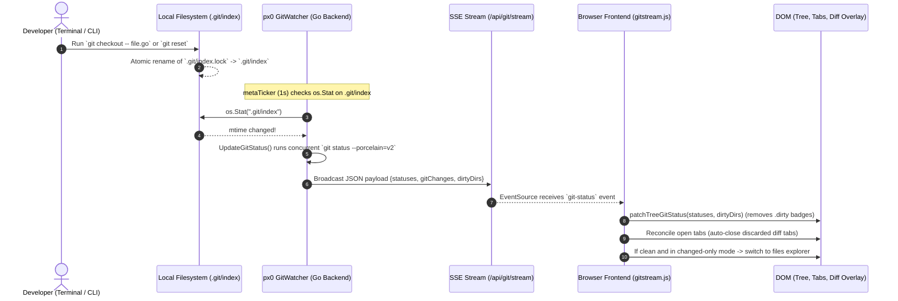

# Git Awareness, Diffing & Stage/Commit/Push/Pull

This document describes the design and implementation of px0's git integration engine ([`git.go`](../../git.go)), its diff-rendering frontend ([`web/src/diff.js`](../../web/src/diff.js)), and the sidebar git panel that stages, commits, pushes, and pulls ([`web/src/gitpanel.js`](../../web/src/gitpanel.js), [`web/src/tree.js`](../../web/src/tree.js)).

## 1. Zero-Dependency Shell-Out Architecture

px0 avoids heavy third-party Go git libraries (such as `go-git`, which can consume large amounts of memory re-parsing packfiles, or `libgit2`, which requires CGO).

Instead, px0 adheres to a Pure Shell-Out Architecture:

- Shells out directly to the host `git` binary, for reads (`status`, `diff`, `merge-base`) and, since the git panel, for writes (`add`, `reset`, `commit`, `push`, `fetch`, `merge --ff-only`, `reset --hard`).
- Status and diffing themselves never stage, commit, or change refs or the index — that half of the engine is still purely read-only. The git panel's write endpoints (`/api/git/stage`, `unstage`, `commit`, `push`, `pull`) are the only exception, and every one of them fires exactly once per explicit click; nothing runs on a timer or in response to a file change. See §9.
- A dispatched coding harness ([Harness Editing & Agent Dispatch](agent-editing.md)) can still write anything else in the workspace — including, via **Commit with AI**, the *text* of a commit message — but never touches git state itself; only px0's own git-panel endpoints do that.
- Zero disk footprint: holds all status and diff structures in volatile memory on the `Index` (`Node.Status`, `Node.Staged`).
- Graceful degradation: if `git` is not installed, or if the opened directory is not a git repository, git features degrade silently without warnings or errors.
- Can be disabled explicitly using the `-no-git` CLI flag.

## 2. Concurrent Status Generation

On large repositories, running `git status` can take 50-100 milliseconds. Running this serially during startup would delay index readiness.

px0 runs `git status` concurrently alongside the filesystem walk:

```go
gsCh := make(chan map[string]string, 1)
go func() { gsCh <- gitStatus(ix.root) }()

// Walk directory tree concurrently...
walk(ix.root, "", root)

// Overlay git status onto index nodes
gs := <-gsCh
```

### Git Command Specification

px0 invokes:

```bash
git status --porcelain=v2 -z
```

- `--porcelain=v2`: Machine-readable format immune to user git config customizations.
- `-z`: NUL-delimited output preventing issues with filenames containing spaces, tabs, quotes, or Unicode characters.

## 3. In-Memory Status & Dirty Folder Propagation

Git status codes are mapped onto tree nodes:

- `M`: Modified
- `A`: Added / Staged
- `D`: Deleted
- `U`: Untracked
- `R`: Renamed

Separately, `Node.Staged` (a plain bool, not folded into the status letter) tracks whether a file has staged index changes — see §9 for how the git panel populates and reacts to it.

### Ancestor Folder Dirty Propagation (`Node.Dirty`)

When a file is modified, its status is recorded on its `Node.Status`. Furthermore, every ancestor folder in its path hierarchy is marked `Dirty: true`:

```go
for p := rel; p != ""; {
    if i := strings.LastIndexByte(p, '/'); i >= 0 {
        p = p[:i]
    } else {
        p = ""
    }
    for i := range children[p] {
        if children[p][i].Dir && isAncestor(children[p][i].Path, rel) {
            children[p][i].Dirty = true
        }
    }
}
```

This enables the file tree in the sidebar to visually highlight collapsed directories that contain modified descendants, allowing developers to immediately spot repository changes.

## 4. Diffing: One Git Call, Two Consumers, Three Views

Both the line gutter and the full diff view are read off the same shell-out, `gitDiff(root, relpath)`:

```bash
git diff --no-color HEAD -- <path>
```

The raw unified diff text is cached at that call site; everything downstream (line-range extraction in Go, and hunk parsing in the browser) is a pure parse of that one string, so a file is never diffed against `HEAD` more than once per request.

### Gutter Change Indicators (`/api/gutter?path=...`)

When viewing a file, the editor displays green, blue, and red markers in the line gutter indicating local edits. `gitHunks(root, relpath)` (`git.go`) runs `gitDiff` and walks its `@@ -l,s +l,s @@` hunk headers and `+`/`-` lines with a small state machine, bucketing every changed line into 1-based **new-file** line numbers:

- `added`: Pure insertions.
- `modified`: Lines replaced (a `-` run immediately followed by a `+` run).
- `deleted`: One marker per pure-deletion run, placed at the new-file line the deletion sat before.

`/api/gutter` returns these three arrays; `web/src/tabs.js` fetches them once per opened tab and `web/src/renderer.js` paints them as `box-shadow` bars (added/modified) or a small wedge (deleted) on the `.g` line-number cell — O(1) per visible row, no re-parsing on scroll.

### File Diff (`/api/diff?path=...`)

`handleDiff` (`server.go`) returns `{ path, diff, available }` — the same raw text `gitDiff` produced, with `available` set whenever it's non-empty (clean or untracked files get `""`). No hunk parsing happens on the server for this endpoint; the client owns that, because it needs two different reshapes of the same hunks (split and unified) and re-parsing client-side avoids two server round trips or two response shapes for one diff.

### Split & Unified Views (`web/src/diff.js`)

The active tab gets a `Source | Diff` switch next to the tab bar (`#diff-switch`, shown only when `d.diffAvailable`) whenever the open file is modified in a git repo. `#diff-source` and `#diff-btn` each show their own view, and hovering the Diff half opens the Split/Unified menu; `Cmd/Ctrl+D` toggles the same thing, resuming whichever layout was used last (`localStorage['px0.diffLayout']`, default `split`). Diff view and the Markdown preview are mutually exclusive — entering one hides the other — and each tab remembers its own state on `d.diffMode` (`'split' | 'unified' | null`).

Unlike the main code view, the diff is **not** rendered through the virtualized `#rows` viewport. A single file's diff is small (bounded by the size of that one file), so `diff.js` renders it as plain DOM into a dedicated `#diffview` overlay — the same overlay-over-`#viewport` pattern the Markdown preview uses (see [Markdown Preview](markdown.md)), just with its own content:

1. **Parse.** `parseDiff(text)` splits the raw diff on `@@ ... @@` hunk headers and walks each hunk's `+`/`-`/context lines once, tagging every row `add` / `del` / `ctx` and carrying its old-file and/or new-file line number. This runs once per file per session; the parsed hunks are cached on `d.diffHunks` so switching Split ↔ Unified re-renders from memory with no re-fetch.
1. **Unified layout.** One row per parsed line: old-line column, new-line column (whichever side doesn't apply is blank), a `+`/`-` marker, and the code — a direct read of `d.diffHunks`, GitHub-"unified"-style.
1. **Split layout.** `pairRows(hunk.rows)` walks each hunk and pairs a deletion run with the addition run immediately following it, index by index, padding the shorter side with a blank cell (`.diff-blank`) — the same replacement-block pairing GitHub's split view uses. Context lines pass straight across both columns unpaired. Each pair renders as one flex row with a left/right half, so the two columns stay vertically aligned for free — no synced-scroll JavaScript, because both halves of a pair are literally the same DOM row.

Every rendered row that exists in the working tree carries its line in `data-l`, on both halves of a split context row; a deleted row carries `data-at`, the working-tree line it sat before. `selbar.js` reads these so a selection anywhere in the diff can drive the selection bar, the right-click menu and Edit with Agent (see [Harness Editing & Agent Dispatch](agent-editing.md)).

Both layouts share the same hunk-header, line-number, marker, and code-cell builders; only the row-shape (one column vs. two) differs, so a fix to how a line renders never needs to be made twice.

## 5. Real-Time Streaming & Adaptive Monitoring Engine

To keep git statuses, sidebar badges, and editor gutter diff indicators in sync without requiring manual page reloads or full workspace re-indexing, px0 uses a hybrid real-time monitoring engine (`git_watcher.go` and `web/src/gitstream.js`).

### Design Constraints: Small vs. Massive Repositories

| Approach | Small Repo (< 1k files) | Massive Repo (> 100k files, e.g. Linux / Chromium) | Verdict |
| :--- | :--- | :--- | :--- |
| **Recursive FS Watcher (`inotify`)** | Fast, low RAM | Exhausts OS watch descriptors (`max_user_watches`), high memory footprint, breaks across symlinks / mount points | **Rejected** |
| **Fixed High-Frequency Polling** | Instant updates (~6ms) | Heavy CPU and battery drain (100k+ file `git status` takes 150ms-1s) | **Rejected** |
| **px0 Hybrid Adaptive Engine** | Sub-millisecond latency, zero RAM overhead | Sub-millisecond on CLI git actions; worktree polling throttled dynamically; CPU usage bounded $\le 10\%$ | **Adopted** |

### Dual-Layer Hybrid Architecture

1. **Sub-millisecond Metadata Stat-Checking (Fast Path)**
   - Every 1 second, px0 checks the `os.Stat` timestamps and sizes of key `.git` control files: `.git/index`, `.git/HEAD`, and `.git/packed-refs`.
   - Any git operation performed in the terminal (`git commit`, `git checkout`, `git add`, `git reset`, `git merge`) immediately touches these files.
   - When a metadata change is detected, px0 triggers an immediate `UpdateGitStatus()` and broadcasts the delta to the frontend within milliseconds without waiting for the next worktree poll.

2. **Adaptive Worktree Polling (Worktree Path)**
   - To catch file changes made outside the git CLI (e.g. saving an editor file or external scripts), the engine polls `UpdateGitStatus()`.
   - **Self-Tuning Frequency**: Measures the exact execution time of the previous `git status` call and adjusts the polling interval:
     $$\text{interval} = \max(2\,\text{s}, \min(15\,\text{s}, \text{execution\_time} \times 10))$$
     On small repositories (~6ms execution), it polls every 2 seconds. On massive repositories (~1s execution), it expands the interval to 10-15 seconds, ensuring git polling never consumes more than a modest fraction of one CPU core.

3. **Visibility & Focus Gating**
   - **Page Visibility API**: When the browser tab is hidden (`document.visibilityState === 'hidden'`), the frontend closes the SSE connection. The backend detects zero active subscribers and pauses background worktree polling completely, saving CPU and laptop battery.
   - **Instant Focus Wakeup**: When the user switches back to px0 (`focus` or `visibilitychange` to visible), the client reconnects and immediately issues a POST to `/api/git/refresh` to catch any changes made while the user was in another application.

4. **In-Memory Concurrency & Tree Updates (`UpdateGitStatus`)**
   - Refreshing git status does not re-walk the directory tree on disk.
   - `Index.UpdateGitStatus()` executes `gitStatus(ix.root)` concurrently, compares the new status map against `ix.gitStatusMap`, and if changed, updates `Node.Status` and `Node.Dirty` in-place on existing `ix.children` nodes.
   - If the status map is identical, no memory allocations or broadcasts occur.

5. **Server-Sent Events (SSE) Stream (`/api/stream` / `/api/git/stream`)**
   - Implemented using Go standard library `http.Flusher` without external dependencies.
   - Dispatches structured events (`git-status` and `metrics`):
     ```
     event: git-status
     data: {"git":true,"gitChanges":2,"gitFiles":["main.go","git.go"],"statuses":{"main.go":"M","git.go":"M"},"dirtyDirs":{"web":true}}
     ```
   - Sends `: ping\n\n` comments every 15 seconds to keep connections alive across reverse proxies.

6. **In-Place DOM Patching (`web/src/tree.js`)**
   - The frontend receives the delta payload and calls `patchTreeGitStatus(statuses, dirtyDirs)`.
   - Rather than tearing down the sidebar file tree, it toggles `.dirty` on directory rows and updates badge elements (`.gs`) and `.git-*` status classes on affected file rows.
   - Tab diff dots (`.tab-git-dot`), diff toggle buttons (`#diff-switch`), and active editor gutter lines are refreshed in-place without disturbing scroll position or editor state.

## 6. How Git Detects Changes Under the Hood

To understand why px0's metadata stat-checking fast path works in sub-milliseconds, it is essential to understand how Git itself detects changes in the working tree.

### The Stat Cache (`.git/index`)

Git does **not** read or compute cryptographic hashes (SHA-1 / SHA-256) of every file in the repository on every status check. On a 50,000-file repository, reading and hashing gigabytes of source code would take tens of seconds and stall developer workflows.

Instead, Git maintains a binary cache in `.git/index` containing metadata for every tracked file:

* **`mtime`**: Last modified timestamp (stored as seconds and nanoseconds).
* **`ctime`**: Status change timestamp.
* **`size`**: Exact file size in bytes (truncated to 32 bits).
* **`inode` & `dev`**: File system device and inode numbers.
* **`mode`**: File permissions (e.g. `100644` standard, `100755` executable, `120000` symlink).
* **`blob SHA`**: The hash of the file contents when it was last staged or committed.

```
Working Tree File                      .git/index (Binary Cache)
┌─────────────────────────┐            ┌────────────────────────────────────────┐
│ src/main.go             │            │ src/main.go                            │
│ - size: 4,120 bytes     │  lstat()   │ - cached size: 4,120 bytes             │
│ - mtime: 09:15:02.1492  │ ◄────────► │ - cached mtime: 09:15:02.1492          │
│ - inode: 849201         │  metadata  │ - cached inode: 849201                 │
│                         │ comparison │ - blob SHA: 3a7f92b1c8e0...            │
└─────────────────────────┘            └────────────────────────────────────────┘
```

### The `lstat()` Fast-Path

When `git status` or `git diff` runs:

1. **Lightweight System Call**: Git calls `lstat()` on each working tree file. `lstat()` only reads filesystem directory entries and inode records; it does not read file contents.
2. **Metadata Comparison**: Git compares the file's live `mtime`, `size`, `inode`, and `mode` against the record stored in `.git/index`.
3. **Instant Skip (Unchanged)**: If the metadata matches identically, Git **guarantees the file is untouched**. It skips reading or hashing the file completely.
4. **Targeted Read (Modified)**: Only when the timestamp, size, or mode differs does Git open the file, calculate its blob SHA, and compare it against the cached `blob SHA`.
5. **Merkle Tree Pruning (`Index` vs `HEAD`)**: For comparing staged files against the `HEAD` commit, Git compares the 20-byte/32-byte tree hashes. If a directory tree hash matches `HEAD`, the entire subdirectory subtree is skipped in memory without examining individual files.

Because `lstat()` is memory-cached by the OS VFS page cache, a full `git status` scan across 50,000 files completes in 10–25 milliseconds.

### Why Every Git CLI Command Touches `.git/index`

Whenever a developer runs a Git command in the terminal (`git checkout`, `git reset`, `git add`, `git commit`, `git restore`, `git stash`, or `git merge`):

* Git updates the working tree and writes a new index via an atomic `.git/index.lock` swap (`rename()`).
* This atomic rename guarantees that the `mtime` and `ctime` of `.git/index` change.
* Git also updates `.git/HEAD` or ref pointers (`.git/refs/heads/<branch>` or `.git/packed-refs`).

By monitoring the `os.Stat` timestamp of just `.git/index`, `.git/HEAD`, and `.git/packed-refs`, px0's fast path detects any terminal Git action in sub-millisecond time without scanning the workspace.

---

## 7. End-to-End Reactive Streaming Architecture

The following sequence illustrates the entire lifecycle from an external git checkout/reset command in a terminal to the real-time UI reconciliation in the browser:



### Auto-Closing Discarded / Reset Diff Tabs

When developers use px0 to inspect AI agent changes or review git branches, they frequently open modified files directly in git diff view (`diffMode: 'split' | 'unified'`). When changes to those files are subsequently discarded or checked out in the terminal (`git checkout -- file` or `git reset`):

1. **Diff Tab Tracking**: Tabs opened with git changes or toggled into diff view are tagged with `openedInDiffView = true` alongside `diffMode` in [`web/src/tabs.js`](../../web/src/tabs.js).
2. **Reverse-Order Reconciliation**: When `handleGitStatus(data)` receives an updated status payload where `statuses[t.path]` is clean (`!isDiff`):
   ```javascript
   for (let i = S.tabs.length - 1; i >= 0; i--) {
     const t = S.tabs[i];
     const code = statuses[t.path];
     const isDiff = !!code && code !== 'U';
     const wasDiff = !!(t.diffMode || t.openedInDiffView);
     if (wasDiff && (t.diffAvailable || t.diffMode) && !isDiff) {
       closeTab(i);
     }
   }
   ```
   Iterating in reverse index order ensures index stability when removing multiple tabs simultaneously.
3. **Active Pointer Stability**: In `closeTab(i)`, closing tabs to the left of the currently active tab decrements `S.active` (`S.active--`) rather than jumping the user to an unintended tab.
4. **Empty State & Explorer Fallback**: If all git changes are discarded while the sidebar is in changed-only mode (`#tree.changed-only`), px0 automatically toggles back to standard file explorer mode so the user is never left viewing an empty tree.

## 8. Diffing Against an Arbitrary Base

`gitDiff`/`gitHunks` above are thin `base="HEAD"` wrappers around `gitDiffAgainst`/`gitHunksAgainst`, which take an arbitrary base ref rather than assuming the working tree's `HEAD`. The one other caller is PR review (`px0 <url>`), which diffs a checked-out PR against its merge-base with the target branch instead. See [GitHub PR Review](github-pr-review.md).

## 9. Stage, Commit, Push, Pull

The sidebar git panel (`web/src/gitpanel.js`) and the file tree's per-row stage tick (`web/src/tree.js`) are the write half of git integration. Every action is a single explicit HTTP call from a button or tick click; nothing here is triggered by the status watcher, a timer, or a file change.

### Staged-Path Tracking

`gitStagedPaths(root)` (`git.go`) runs `git diff --name-only --cached -z` and maps each path through the same `repoRelKey` helper `gitStatusAgainst` uses, so staged state is keyed identically to status. `Index.gitStagedMap` and `Node.Staged` carry it alongside the existing `gitStatusMap`/`Node.Status`, populated in both `Index.Build()` and `Index.UpdateGitStatus()`. `UpdateGitStatus`'s "did anything change" check compares *both* maps — staging a file often leaves its collapsed status letter unchanged (a modified-and-unstaged `M` and a modified-and-staged `M` are the same letter), so comparing status alone would silently swallow a stage/unstage broadcast. `GitStatusPayload` (`git_watcher.go`) carries the resulting `Staged` map and the current `Branch` name (`gitCurrentBranch`) down the same SSE stream (`/api/stream`) that already pushes status.

### Stage / Unstage / Commit

`gitStage`/`gitUnstage`/`gitCommit` (`git.go`) are thin wrappers around `git add -- <path>`, `git reset -- <path>`, and `git commit -m <message>`. An empty path to `gitStage` means "the served root itself", so **Stage All** reuses the same `/api/git/stage` endpoint with `path: "."` instead of a dedicated route. `gitCommit` checks `gitStagedPaths` before shelling out, so an empty index fails fast with "nothing staged to commit" rather than surfacing git's own message. All three endpoints (`handleGitStage`, `handleGitUnstage`, `handleGitCommit` in `server.go`) validate `path` through `s.safePath` — the same traversal guard `handleFile`/`handleRaw` use — and call `s.gitWatcher.Trigger()` on success so the SSE stream broadcasts immediately instead of waiting for the next poll tick.

### Fast-Forward-Only Pull

`gitFFOnlyPull(root, remote, ref)` fetches `ref` from `remote` and runs `git merge --ff-only FETCH_HEAD`. If that merge fails for any reason, it returns the sentinel `errNotFastForward` without having touched history — px0 never falls back to a real merge, so there is never a conflicted state to clean up. `handleGitPull` (`server.go`) checks `gitHasUncommittedChanges` first and refuses outright (409) if the working tree is dirty, then resolves the branch's upstream (`gitUpstream`, wrapping `git rev-parse --abbrev-ref <branch>@{u}`) and calls `gitFFOnlyPull`. A `409` with `errNotFastForward` becomes a plain-language refusal ("can't fast-forward ... resolve manually, not supported here") rather than raw git output.

In a PR review session, Pull instead re-syncs with the pull request's current head — see [GitHub PR Review §7](github-pr-review.md).

### Push

For a plain workspace, `handleGitPush` runs a bare `gitPush` (`git push`); if that fails specifically because the branch has no upstream, it retries once with `gitPushSetUpstream(root, "origin", branch)`. Neither path ever forces. In a PR review session, `s.pr.Push()` takes over instead — see [GitHub PR Review §7](github-pr-review.md).

### Commit with AI

**Commit with AI** is a text-generation dispatch, not a file edit: `agentManager.StartPrompt(label, prompt)` (`agent.go`) is a sibling of `StartBatch` that skips every file-range concern — no snippet read, no overlap check, no target path — and reuses the same `run()` executor (spawn, stream stdout/stderr into `tailBuffer`s, `changedSince` diff). `handleGitCommitMessage` (`server.go`) builds the prompt from the staged file paths (`gitStagedFiles`), diffstat (`gitStagedStat`), capped staged diff (`gitStagedDiff`), and the `git.commitMessageInstruction` setting via `commitMessagePrompt` (`agent.go`), and refuses with 400 before ever dispatching a harness if nothing is staged. The frontend polls the returned job through the same `/api/agent/job` endpoint an inline edit uses, drops the (fence-stripped) `stdout` into the commit textarea, and immediately calls `/api/git/commit` with it — two endpoints, one user action.

### HTTP Surface

| Endpoint | Method | Purpose |
| --- | --- | --- |
| `/api/git/stage` | POST | `{path}` — stage a file, or `"."` for everything. |
| `/api/git/unstage` | POST | `{path}` — unstage a file. |
| `/api/git/commit` | POST | `{message}` — commit whatever is staged. `400` if nothing is. |
| `/api/git/push` | POST | Push the current branch, or (PR session) the PR's head branch. |
| `/api/git/pull` | POST | Fast-forward pull, or (PR session) re-sync with the PR head. `409` on divergence or uncommitted changes. |
| `/api/git/commit-message` | POST | Dispatch the selected harness to write a commit message for the staged diff. Returns an `agentJob`, polled via `/api/agent/job`. `400` if nothing is staged or no harness is selected. |

Every write endpoint is guarded by `localPost` ([`lspsetup.go`](../../lspsetup.go)), the same POST-only, same-origin, IP-or-localhost check every other mutating px0 endpoint uses.

