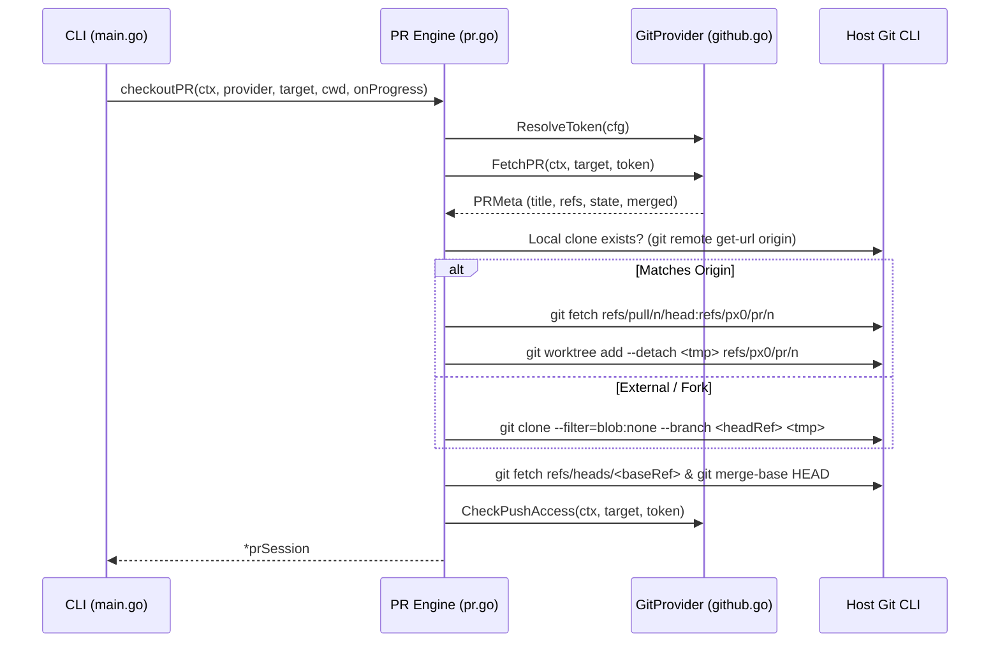

# Git Forge PR Review & Provider Architecture

This document describes the design and implementation of px0's pull request review feature: the `GitProvider` abstraction layer ([`provider.go`](../../provider.go)), GitHub REST implementation ([`github.go`](../../github.go)), checkout lifecycle and progress reporting ([`pr.go`](../../pr.go)), merge-base diffing ([`git.go`](../../git.go)), and the frontend review interface ([`web/src/pr.js`](../../web/src/pr.js), [`web/src/linecomment.js`](../../web/src/linecomment.js)).

---

## 1. Zero-Dependency, Process-Scoped Design

Two core px0 tenets shape pull request reviews:

- **Zero-dependency shell-out**: Like `git.go` (which links no Go git library), px0 avoids external forge SDKs. `github.go` uses standard Go `net/http` against the GitHub REST API, plus an optional shell-out to `gh auth token`. Checkout itself uses standard `git fetch`, `git worktree add`, or `git clone` via `exec.Command`.
- **Stateless on disk**: px0 maintains no persistent cache in `~/.px0`. A PR checkout is strictly process-scoped: `checkoutPR` (`pr.go`) places the worktree in `os.MkdirTemp("", "px0-pr-*")`, and `prSession.Close` removes it upon exit (`Ctrl+C` or normal shutdown). This ensures zero leftover disk clutter and prevents stale cache bugs.
- **In-memory draft comments**: Draft comments live in `prSession.comments` as a thread-safe, mutex-guarded slice in server memory. They never touch disk and vanish when the process exits (submitted or discarded).

---

## 2. Extensible Forge Architecture (`GitProvider`)

To support multiple git forges (GitHub, GitLab, Bitbucket, etc.) without entangling core review logic, forge interactions are abstracted behind the `GitProvider` interface in [`provider.go`](../../provider.go):

```go
type GitProvider interface {
    Name() string
    MatchURL(rawURL string) bool
    ParseURL(rawURL string) (PRTarget, error)
    ResolveToken(cfg settings) (token, source string)
    FetchPR(ctx context.Context, target PRTarget, token string) (PRMeta, error)
    CheckPushAccess(ctx context.Context, target PRTarget, token string) bool
    SubmitReview(ctx context.Context, target PRTarget, token, headSHA string, comments []prComment, event, body string) error
}
```

### Data Models
- **`PRTarget`**: Normalized identifier containing `Provider`, `Owner`, `Repo`, `Number`, and original `URL`.
- **`PRMeta`**: Standardized metadata across all providers:
  - `Number`, `Title`, `Author`
  - `State`, `Merged`, `MergedAt`
  - `Draft`
  - `BaseRef`, `HeadRef`, `HeadSHA`
  - `HeadRepoCloneURL`, `HeadIsFork`

### URL Matching & Routing
Pull requests are opened exclusively via `px0 <url>`. URL routing in `main.go` calls:
```go
provider, target, ok := DetectPRURL(arg0)
```
- Iterates over `defaultProviders` (which includes `&GitHubProvider{}`).
- If a provider matches and successfully parses the URL, px0 enters PR review mode.
- Bare numbers (e.g. `px0 123`) and file paths are never mistaken for PR targets; they are processed as regular filesystem paths.
- Running `px0 pr` outputs an explicit error guiding the user to pass the URL directly.

---

## 3. Checkout Lifecycle & Progress Narration

`checkoutPR` (`pr.go`) executes the following sequence:



### CLI Progress Narration
`checkoutPR` accepts an `onProgress func(string)` callback. In `main.go`, this drives a smooth amber `uiSpinner`:
1. `Fetching PR #... metadata from <provider>...`
2. `Fetching PR #... head and preparing worktree...` (or cloning)
3. `Computing merge base with <baseRef>...`
4. `PR #... checked out (<title>)` (or `[merged]` if already merged)

### Merged PR Handling
When `meta.Merged` is true, px0 does not block or prompt: it proceeds immediately to check out the PR and surfaces the merged status with a `[merged]` badge in the CLI and a purple `Merged` pill badge in the review header.

---

## 4. Authentication & Push Access

`GitHubProvider.ResolveToken` queries four sources in order:
1. `github.token` in `settings.json` (or via Settings modal).
2. `GITHUB_TOKEN` environment variable.
3. `GH_TOKEN` environment variable.
4. `gh auth token` (GitHub CLI session).

### Fail-Closed Push Access
`CheckPushAccess` queries `GET /repos/{owner}/{repo}` and extracts `permissions.push`. It **fails closed**: any network error, HTTP error, or missing permission field yields `false`.
- Gating: `Server.handlePRMeta` passes `writeAccess` to the frontend.
- Enforcement: `Server.handlePRSubmit` enforces push access server-side before accepting `APPROVE` or `REQUEST_CHANGES`.

### Unauthenticated Read-Only Mode
If no token is found:
- Public repository metadata, worktree creation, and diff calculation proceed normally.
- Draft comments can be created in memory and batch-applied locally with AI agents.
- The CLI banner alerts the user:
  ```text
  access: read-only (no github token: set GITHUB_TOKEN or gh auth login to submit reviews)
  ```

---

## 5. Merge-Base Diffing

Unlike standard working tree diffs that compare against `HEAD`, PR reviews compare against the commit where the PR branch diverged from the base branch (the merge-base):

```go
func gitMergeBase(root, a, b string) string
```

- When the base branch ref is fetched, `diffBase` is set to `gitMergeBase(tmp, "HEAD", baseRef)`.
- If base ref resolution fails, it gracefully falls back to `"HEAD"`.
- `Server.diffBase` propagates this ref to `gitDiffAgainst` and `gitHunksAgainst`, ensuring both gutter markers and `Cmd/Ctrl+D` views display only what the PR changes.

---

## 6. Draft Comments, Submission & Batch Apply

### In-Memory Drafts
- `GET /api/pr/comments`: Returns current drafts.
- `POST /api/pr/comments`: Appends a line comment (`Path`, `Line`, `Side`, `Body`). Allowed unauthenticated so reviewers can draft feedback locally.
- `POST /api/pr/comments/delete`: Deletes a draft by ID.

### Batch Apply with Coding Agents (`⚡ Batch Apply`)
Users can delegate all drafted PR comments directly to an AI coding agent (Claude Code, Gemini CLI, Cursor Agent, Antigravity, etc.). The agent harness receives the comments as targeted editing instructions and modifies the worktree files directly.

### Formal Review Submission
- `POST /api/pr/submit`: Requires auth token.
- Calls `provider.SubmitReview` which constructs a single review payload containing the head commit SHA, all drafted comments, and the review body/event (`APPROVE`, `REQUEST_CHANGES`, `COMMENT`).
- Clears in-memory drafts upon successful submission.

---

## 7. Committing and Pushing Back to the PR

A PR checkout is process-scoped (§1) but not read-only: the sidebar git panel ([Git Awareness §9](git-integration.md)) works inside it, with `prSession.Pull` and `prSession.Push` (`pr.go`) replacing the plain-workspace fast-forward/push logic when `s.pr != nil` (`server.go`'s `handleGitPull`/`handleGitPush`).

### Why the Checkout Needs Its Own Push/Pull

The worktree `checkoutPR` produces sits on a **detached** `HEAD` at `refs/px0/pr/<N>` (§3) — not the PR's branch name, and (in the worktree case) `origin` points at the *base* repository, which for a fork PR is not where the PR's commits live. A bare `git push`/`git pull` would either push nowhere useful or fail outright, so both operations are reimplemented against the PR's actual metadata instead of the checkout's local remote config.

### `prSession.Pull`: Fast-Forward Only, Same as Everywhere Else

1. Refuses immediately if `gitHasUncommittedChanges(worktree)` — nothing here stashes.
2. Re-fetches the PR head: `git fetch origin refs/pull/<N>/head:refs/px0/pr/<N>` in the worktree case (shared refs with `srcRepo`, same as the initial checkout), or a direct fetch of `meta.HeadRepoCloneURL`/`meta.HeadRef` into `FETCH_HEAD` in the bare-clone case.
3. `git merge-base --is-ancestor <newRef> HEAD` — if the fetched ref is already an ancestor of the current checkout, it's a no-op ("already up to date"), not an error.
4. `git merge-base --is-ancestor HEAD <newRef>` — if the current checkout is a clean ancestor of the fetched ref, `git reset --hard <newRef>` fast-forwards it (safe: step 1 already guaranteed a clean working tree).
5. Otherwise — a local commit the PR head doesn't have, or a force-pushed head that isn't a fast-forward at all — `errPRDiverged` refuses the pull. Exactly like the plain-workspace path, this never invokes `git merge`, so there is never a real conflict to clean up.
6. On a successful fast-forward, `p.meta.HeadSHA` and `p.diffBase`/`p.diffBaseWarning` are recomputed via the same `computeDiffBase` helper `checkoutPR` uses, and `handleGitPull` propagates the new `diffBase` to `s.diffBase`/`ix.SetDiffBase()` so `/api/diff`, `/api/gutter`, and the tree's status-against-base all pick it up immediately. The frontend (`gitpanel.js`) follows a successful pull with a full `reindexWorkspace()` plus `pr.js`'s `refreshPRMeta()` — a fresh `/api/pr/meta` fetch, a `renderBar()`, and a re-fetch of existing comments — so the PR bar, diff warning, and comment threads all reflect the new head, not the one captured at session start.

### `prSession.Push`: Straight to the PR's Own Branch

`git -C worktree push <meta.HeadRepoCloneURL> HEAD:refs/heads/<meta.HeadRef>` — pushing a URL directly rather than a named remote sidesteps any ambiguity between `origin` (the base repo) and the PR's actual head repo (a fork, in the common case). It is never forced: if the PR head has moved since this checkout (or the last successful Pull), the remote rejects the push as non-fast-forward and that rejection surfaces to the user verbatim, exactly as it would from a terminal.

Unlike a formal review submission, Push is not gated on `p.writeAccess` — that field reflects push access to the *base* repository (checked for `APPROVE`/`REQUEST_CHANGES`, §4), which is a different permission than push access to the head repository. Push is always attempted; a permission failure surfaces as git's own rejection rather than a pre-emptive block.

### Why This Matters for the Checkout's Lifetime

`prSession.Close` (§1) force-removes the worktree and deletes `refs/px0/pr/<N>`/`refs/px0/base/<N>` when the process exits, with no warning if there are uncommitted or unpushed commits sitting in it. Push is the only way work done in a PR checkout survives past the session — the git panel exists in PR review specifically so that loop (edit, commit, push) never requires dropping out to a terminal mid-review.

---

## 8. Frontend Integration

- **Hover Line Thread Icon (`web/src/linecomment.js`)**:
  - Displays a thread icon (a CSS-masked speech bubble on `.line-btn`) when hovering over line numbers in source or diff views.
  - Clicking calls `openLineMenu()` in `selbar.js`, the selection menu aimed at one line. Rows GitHub knows about pass a `fromDiff` description with the diff side, which is what enables **Add Review Comment** there; other rows get only the local actions.
- **PR Header Bar (`web/src/pr.js`)**:
  - Renders PR number, title, author, branch refs, and draft count badge.
  - Toggles `#pr-merged-badge` (purple pill) when `meta.merged` is true.
  - Houses **⚡ Batch Apply** and **Submit Review** controls.
- **Child PR Launching**:
  - Command Palette **Git: Open Pull Request…** posts to `/api/pr/launch`.
  - Spawns `px0 -y <url>` in a new detached process on an ephemeral port.
- **Git Panel Resync (`web/src/pr.js`'s `refreshPRMeta`)**:
  - Called by `gitpanel.js` after a successful Pull. Re-fetches `/api/pr/meta`, re-renders the PR bar, and re-fetches existing/draft comments, so a PR that moved forward under the reviewer never leaves the bar, diff warning, or comment threads showing the state from session start.
