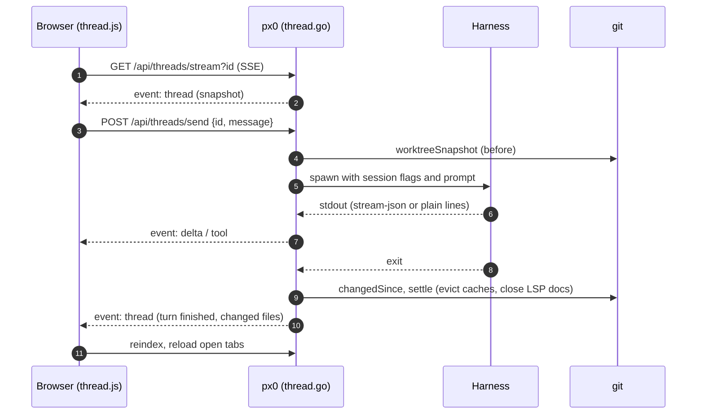

# Threads

This document describes the design and implementation of threads, the long-running multi-turn conversations with a coding harness:

- the store, turn runner, event feed and HTTP surface: [`thread.go`](../../thread.go)
- the selected harness and change settling it reuses: [`agent.go`](../../agent.go)
- the sidebar views, streams and composer: [`web/src/thread.js`](../../web/src/thread.js)

Threads are the conversational sibling of [inline edits](agent-editing.md). They share the harness selection, the headless invocation contract, `changedSince` and `settle`. They differ in three ways: a thread persists, it continues one harness session across turns, and it has no overlap guard.

## 1. Model

A `thread` holds an id, a title (the first line of the first message), an optional anchor (`path`, `l1`, `l2`, and a `snippet` of those lines read by the server at creation), and its `turns`. A `threadTurn` holds the prompt, the accumulated `reply`, one line per tool call in `tools`, the `changed` files, an error, and the harness and model that ran it.

The anchor's snippet is read by `readLineRange` on the server, so the client never supplies file content. It is prompt context only, and the prompt says the file may have changed since.

## 2. Session Continuity

A turn is a fresh process, so continuity is carried one of two ways:

| Mode | Harnesses | How |
| --- | --- | --- |
| Native session | `claude`, `cursor-agent` | px0 owns the session id. claude: `--session-id <uuid>` on the first turn, `--resume <uuid>` after. cursor-agent: `create-chat` returns an id, then `--resume <id>` every turn. The harness keeps its own context, so a later turn sends only the new message. |
| Replay | every other harness | Each turn's prompt carries the earlier turns as `User:` / `Assistant:` text, plus the files each turn changed, capped at `threadReplayMax` bytes (most recent kept). |

`threadArgv` injects the session flags right after the binary (flag order does not matter to these CLIs), so the preset argv, including the model flag and permission mode, is unchanged. Only harnesses whose flags were verified are in the native list; adding one is a case in `threadArgv` and `threadNative`.

Two rules keep this honest:

- **A session belongs to the harness that made it.** `SessionHarness` records the owner. Switching harness mid-thread clears the session, and the new harness is primed by replay.
- **Only a live session is trusted.** `SessionLive` is set once the harness has really started the session (claude reported a `session_id`, or cursor-agent finished a turn). If a first turn failed before that, the next turn replays instead of resuming a session that may not exist.

The anchor and ground rules ("you may read and edit any file, reply with a concise summary") go into the prompt only when the harness has no memory of them: the first turn, or a replay.

## 3. Output and Streaming

`claude` is run with `--output-format stream-json --verbose`. `threadSink` reads it line by line through `parseClaudeEvent`:

- `assistant` text blocks are appended to the reply, each set off from the last by a blank line.
- `assistant` `tool_use` blocks become a one-line step such as `Edit calc.go` (`toolLabel`).
- a `result` with `is_error` fails the turn; a successful `result` fills the reply only if no text arrived.

Events arrive per assistant message, not per token. Every other harness has its stdout treated as the reply, line by line. stderr goes to a `tailBuffer` and is appended to the error only when the turn failed with no reply.

The feed is Server-Sent Events at `/api/threads/stream`:

| Event | Payload | Sent to |
| --- | --- | --- |
| `thread` | full thread | `?id=` subscribers: on connect, and when a turn starts or finishes |
| `delta` | `{turn, text}` | `?id=` subscribers, as the reply grows |
| `tool` | `{turn, text}` | `?id=` subscribers |
| `list` | all summaries | list subscribers, on connect |
| `summary` | one summary | list subscribers, on any change |
| `deleted` | `{id}` | both |

`subscribe` registers the channel and takes the snapshot under one lock, so no event falls between them. A subscriber that cannot keep up (channel of 256 full) is dropped and closed, and the browser's `EventSource` reconnects to a fresh snapshot, so events are never delivered out of order. The list stream also carries `touched` (the last turn changed files or could not say), which is what makes the browser reload open tabs when a turn finishes.

## 4. Persistence

Threads are stored per workspace at `<config dir>/threads/<sha256(root)[:8]>.json`, beside `settings.json` (`$XDG_CONFIG_HOME/px0/` or `~/.px0/`), never inside the working tree. The file is written atomically (temp file, then rename) with mode `0600`, since it holds code snippets and replies.

It is saved when a turn starts, when it ends, on delete, and at most every two seconds while a reply is streaming, so an exit mid-turn loses seconds rather than the answer. On load, any turn still marked running is closed as interrupted, since its process died with px0.

## 5. Concurrency

One turn runs per thread at a time: sending to a busy thread returns `409`. Different threads, and threads alongside inline edits, run concurrently with no overlap guard: last write wins. Changing the harness is not blocked by running threads, unlike running inline edits, because a running turn already holds the argv it started with.

Because turns can overlap, a turn's `changed` list is what differed in the worktree between its start and end, which can include a concurrent turn's or edit's changes. It is a good answer to "what moved", and a slightly generous one to "what did this turn do".

A turn is abandoned after 30 minutes (`threadTurnTimeout`). Stop cancels the process group; what it already wrote stays.

## 6. Inline and Batch Edits as Threads

`/api/agent/edit` and `/api/agent/batch` call `StartEdit`. One item becomes a thread of kind `edit` anchored to that range; several become a thread of kind `batch`, whose first message lists every item with its snippet and instruction. The turn then runs exactly like any other.

The edit UI polls `/api/agent/job?id=` and cancels through `/api/agent/cancel`, so threads present themselves in that shape. `threadManager.job` maps a turn to an `agentJob` (error text split into `error` and `stderr`, the reply as `stdout`), job ids come from the same sequence the agent manager uses (`nextJobID`), and the agent manager reaches the thread manager through the `threadJob` and `threadCancel` hooks. `Job(0)`, "the most recent job", returns the newer of the two kinds.

Inline edits keep their overlap guard. `overlappingEdit` refuses an edit on lines a running edit thread still covers, with the same `409` and message as before. Conversations started from the Threads pane are not part of that check, in either direction.

The first-turn prompt for these kinds asks for the change to be made and a one or two sentence summary, and a batch skips the single-anchor snippet because its message carries them.

## 7. HTTP Surface

| Endpoint | Method | Purpose |
| --- | --- | --- |
| `/api/threads` | GET | List summaries, most recent first. Also how the UI detects availability (404 with `-no-agent`). |
| `/api/threads/get` | GET | One thread by `?id=`. |
| `/api/threads/create` | POST | JSON `{path?, l1?, l2?, message}`. Creates the thread and starts its first turn. |
| `/api/threads/send` | POST | JSON `{id, message}`. `409` while a turn is running. |
| `/api/threads/cancel` | POST | Stop the running turn of `?id=`. |
| `/api/threads/delete` | POST | Delete `?id=`, stopping its turn first. |
| `/api/threads/stream` | GET | SSE feed (section 3). |

Every mutating endpoint is guarded by `localPost`, and carries the same security posture as inline edits: it runs a general-purpose coding agent with shell access as the user who started px0.

## 8. Frontend

`thread.js` owns two views in the `#pane-right-threads` pane: the list and one thread (or a draft). `newThread(info)` is registered into `selbar.js` through `setThreadHandler`, the same one-way hook `agent.js` uses. The compose box's harness and model selects are registered with `registerAgentPicker` in `agent.js`, so they show and set the same global selection as every other picker.

The list stream is opened once at startup and drives the running indicators and the tab reload. The per-thread stream is opened when a thread is opened and closed when leaving it. Replies are rendered by a small escape-first Markdown subset (`thrMd`): fences, inline code, bold and bullet lists, so a reply can never inject markup.

## 9. Limits

- Only `claude` and `cursor-agent` resume natively. Others are replayed, and replay is capped at 16 KB of history.
- Reply streaming is per assistant message, not per token.
- `cursor-agent`'s native path is built from its documented `create-chat` and `--resume` flags and was not run end to end here, since that harness needs a paid plan for named models.
- Changes to gitignored files are invisible to `git status`, so they are not listed or reloaded.
- A thread has one anchor. Moving code does not move it.
